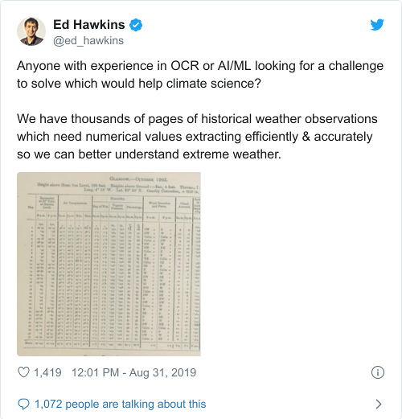
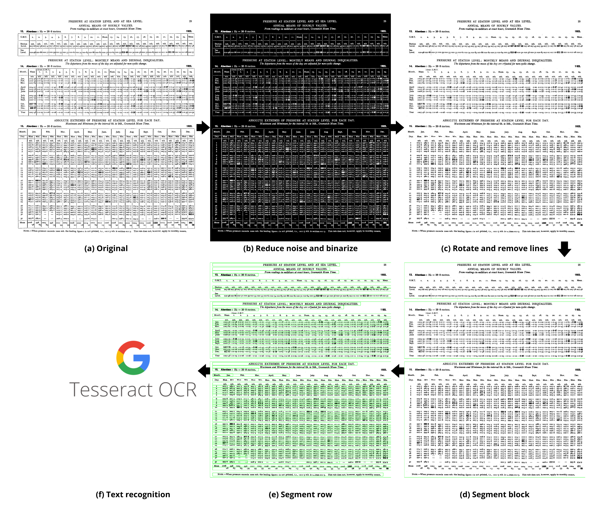

[](https://travis-ci.org/floriancochard/extract-data-from-paper)

# Extract Data from Paper (EDP)
## Description

Note (November 18th, 2019): code will be released when the processing chain is operational (soon).

Historical weather records help understand past climate variability and trends, and develop more accurate climate prediction systems. Until mid-twentieth century, most historical weather records were handwritten or typed and registered in books in the form of tables. Nowadays these documents are digitised to prevent damage or loss, but this process is hampered because:
1. documents are sitting on the shelves of national weather services, waiting to be found, or
2. documents are known and scanned but need workforce to extract information manually.

In a cultural preservation effort, citizen science projects volunteer to rescue and extract observations data from books' tables. Although very effective, the task is repetitive and time-consuming. It took the [Operation Weather Rescue initiative](https://www.zooniverse.org/projects/edh/weather-rescue) 180 days and 3,300 volunteers to digitize 1,300,000 observations ([source](https://www.zooniverse.org/projects/edh/weather-rescue/stats/?classification=month&comment=month)).

*Optical Character Recognition* (OCR) engines allow to extract text from documents. They give great results for computer-generated PDF documents (e.g., [Tabula](https://tabula.technology/) or [Textricator](https://textricator.mfj.io/)) or when input document is clean. However historical materials have multiple limitations that prevent high OCR output accuracy:
- bad paper quality with shadow or uneven contrasts,
- handwritten characters or in non-standard machine-typed fonts,
- complex layout structure,
- curved tables borders or skewed image

The *Extract Data from Paper* project provides a processing chain to extract tabular data from scanned documents (PDF to CSV). Output are available as structured table forms and disseminated to the weather and climate community. The project includes computer vision tools and machine-learning based algorithms to extract numerical data at least 60 times faster than manually at >98% accuracy.

### Use case
Input data is the historical weather data archive from the UK Met Office *[Observatories Year Book](https://digital.nmla.metoffice.gov.uk/SO_5575296f-0406-49f5-89cb-54cd79486b75/)*. It contains 46 books from 1922 to 1967 and each book includes 5 locations of interest, up to 30 variables (e.g., pressure, temperature, rainfall, relative humidity, wind speed and direction, duration of bright sunshine) of which daily extremes of pressure and temperature. Variables are available at daily, monthly and/or annual resolutions and displayed in tabular forms. Working on *Observatories Year Book* archive is motivated three-fold:
1. good documents quality overall
2. few layout variations across tables
3. machine-typed text

Next step of the project will consider [Stations of the Second Order](https://digital.nmla.metoffice.gov.uk/SO_feb1a621-72a3-4501-a6d2-8af1a8abe545/) that have lower archive quality and heterogeneous layouts.

## Motivations
I didn't find any efficient solution to accurately extract data from weather books since the task requires a lot of tailored processing and tuning. Climate and weather community could greatly benefit from tools developed by the computer vision community. In addition, I used to work on a project that simulated historical weather data (see [Hadley Innovation](https://hadley-innovation.herokuapp.com/)) and understand the value the latter represent to the weather community. Last, I stumbled across a tweet from [Ed Hawkins](https://en.wikipedia.org/wiki/Ed_Hawkins_(scientist)) that confirmed the need to develop a text extraction tool for historical weather documents:




## Methodology
Visit the wiki page on [processing chain](https://github.com/floriancochard/extract-data-from-paper/wiki/Processing-chain) for detailed information (**COMING SOON**).

Processing chain is divided four-fold:
1. Image processing
2. Text recognition
3. Text processing and correction
4. Data population from unstructured to structured data

In this project I use the open-source Tesseract OCR system in its 4.1.0 version (July, 2019) to extract data from image. Although Tesseract does some automated [processing operations internally](https://github.com/tesseract-ocr/tesseract/wiki/ImproveQuality) before character recognition, output accuracy for *Observatories Year Book* is low. Hence I developed image processing modules to prepare image and improve text recognition accuracy. Modules are based on open-source computer vision library [OpenCV](https://opencv.org/), python built-in functions, numpy, pandas or scikit-image. They are used to correct non-textual information (i.e., smear, shadow, noise, faint characters), binarize document (i.e., improve contrast between background and text), rotate image to correct skew angle, apply morphological operations to segment regions of interest, and so forth. Image processing methodology is summarized below and detailed further in section *Detailed processing chain*.



Developing a text segmentation and recognition system for any type of document is challenging. Although the image and text processing chain are designed to be robust, the code requires manual tweaking for threshold values or kernel size during morphological operations. At the moment, the script only applies to the *Observatories Year Book* archive. For example, Otsu binarization gives great results for the *Observatories Year Book* archive but can hardly be used on a lower quality document, such as the [Stations of the Second Order](https://digital.nmla.metoffice.gov.uk/SO_feb1a621-72a3-4501-a6d2-8af1a8abe545/). For the latter, some binarization techniques for low quality documents are referenced in the literature and show promising results. Future works will give more credits to these methods; at the moment they are included in the wiki page.

See the [wiki page](https://github.com/floriancochard/extract-data-from-paper/wiki/Processing-chain) for more information about processing and project development roadmap.

## Output
Output are similar to the table below (CSV are not generated yet):

|Meta|Value
|-|-
|Variable|Absolute extremes of pressure at station level for each day
|Location|Aberdeen
|Year|1922

|Month|Jan|   |Feb|   |Mar|   |Apr|   |May|   |Jun|   |Jul|   |Aug|   |Sep|   |Oct|   |Nov|   |Dec|   |
|-----|---|---|---|---|---|---|---|---|---|---|---|---|---|---|---|---|---|---|---|---|---|---|---|---|
|Day  |Max|Min|Max|Min|Max|Min|Max|Min|Max|Min|Max|Min|Max|Min|Max|Min|Max|Min|Max|Min|Max|Min|Max|Min|
|1|003.7|989.1|001.5|993.8|994.7|985.6|008.3|006.2|008.7|004.3|016.3|014.2|006.2|992.2|000.80|001.6|008.5|001.1|013.2|010.2|996.0|977|014.6|000.5|
|2|002.6|987.9|001.3|984.4|010.5|994.7|006.7|999.7|004.3|001.8|014.4|006.2|994.6|990.1|012.1|008.0|013.6|008.5|010.5|008.1|991.6|986.4|020.1|014.3|
|...
|6|009.8|001.5|019.2|017.1|987.7|984.1|008.4|006.2|017.9|011.4|015.9|014.8|996.0|974.86|012.8|009.5|027.1|020.7|025.4|016.4|991.2|979.3|021.9|010.6|
|7|002.5|996.4|017.1|008.4|984.4|978.2|006.3|002.3|018.8|017.0|015.2|012.7|009.3|992.6|009.8|009.1|028.4|025.9|027.2|025.3|999.4|981.9|021.8|012.3|


## Closing remarks

I quickly benchmarked OCR systems with [Microsoft Azure Cognitive Service](https://azure.microsoft.com/en-us/services/cognitive-services/computer-vision/), [Amazon Textract](https://aws.amazon.com/textract/), [Google Vision API](https://cloud.google.com/vision/docs/ocr) and [Tesseract](https://opensource.google/projects/tesseract). First 3 lines from block *Pressure at station level; monthly means and diurnal inequalities* are shown below for quick inter-comparison. Full text recognition output are available for download next to each OCR system's name. In a nutshell, Amazon Textract and Microsoft Azure Cognition Service don't segment correctly the page which negatively impacts recognition. Amazon Textract completely removes the layout structure while Microsoft Azure brings more satisfying results in this regards. Recent release of [Form Recognizer](https://azure.microsoft.com/en-us/services/cognitive-services/form-recognizer/) from Microsoft Azure Cognition Service may improve overall accuracy (not tested). Google Vision API and Tesseract show good segmentation and keep layout structure. In all cases, some characters are still not read correctly and require text post-processing.

In summary, output text recognition accuracy relies heavily on input image quality.

- Amazon Textract ([output](./docs/txt/amazon-textract.txt))

  `It was almost impossible to retrieve the internal layout structure (see output)`

- Microsoft Azure Cognitive Service ([output](./docs/txt/microsoft-azure.txt))
  ```
  IOOI .31 +0.24 +0.21 +0.05 -0.16 -
  -0.22 -0.27
  -0.23 -0.05 +0.06 +0.24 +0.26 +0.12 +0.02 -0.16 -0.27 -0.31 -0.15 -0 02 +0.02 +0.08 +0.07 +0-05 +0.13 + 0.29
  1007.62 +0.23 +0.09 -0.09-0.30-0.38 -0-40-
  -0.33 -0.19 -0.1I -0.01 +0.02 +0-03 -0.05 -
  -0.28 -0.21 +0.05 +0'27 +0.38 +0-43 +0-47 +0.42 +0.38
  ```

- Google Vision OCR ([output](./docs/txt/google-vision.txt))
  ```
  1003'56 +o:38 +o27 tol —о07 —о:22 \~о-37 —о:33 —о18 —о-10 — о-II —о-10 —о-27 -о47 -0-59 —о-55 -о:38.
  10O1 31 +o:24 +o21 to05 —о-16 —о-22 -\~о-27 —о-23 \~о05 +o-об +o-24 +oо-26 +o-12 +о02 —о-16 —о-27 —0-31 —о-15 —о02 +o-02 +o-o8 +oo7 toos to13 +0:29
  I007 62 +o 23 +o.o9-0-09 -o-30 -o-38 -0-40 -o-33 -o-19-o-11 -o oi +o-02 +o*03 -o-05 -o-18 -o-25 -o-28 -o-21 +O 05 +o 27 +o 38 +o 43 +0-47 +o'42 +o-38
  -o 22 +o 02 +o-27 +0'43 +o-57 +o-62 +0-65 +o-62  
  ```

- Tesseract with LTSM (`--oem 1 --psm 6`)([output](./docs/txt/tesseract_OEM1.txt))
  ```
  "AES: H 1003-56 40°38 +027 +0°11 —0-07 —0-22 —0-37 —0-33 —0-I8 —0-I0 —0‘II —0°'I0 —0+27 —0°47 —0-69 —0-55 —0:38 —0-22 +0-02 +027 +043 +0-57 + 0-62 +0-685 +0-62",
  "pCR 100131 40:24 +0°2X 40°05 —0'I6 —0'22 -\~0-27 —0*23 —0'05 +0°06 +0-24 +026 40-12 40:02 —0°16 —0-27 —0-31 —0'15 —0'02 + 0'02 +0-08 40-07 40-05 +0-13 + 0-29",
  "Mar. 100762 +023 +009 —0:09 —0-30 —0-38 —0-40 —0°33 —0'19 —0-11 —0-0I +06+02 40:03 —0-05 —0-18 —0-25 —0-28 —0-21 40-05 + 0°27 40°38 +043 + 0-47 + 0°42 +0-38"
  ```

- Tesseract with Legacy (`--oem 0 --psm 6`)([output](./docs/txt/tesseract_OEM0.txt)) : best result
  ```
  'Jan. 1003-56 +0-38 +0-27 +o-11 —-o-o7 —o-22 —0-37 —o\~33 —o-18 —o-10 —0-n —o-10 —0-27 —o-47 —0-59 —0-55 —o-38 —0-22 +o-02 +o-z7 +o-43 +o-57 +o\~62 +005 +o-62',
  "Feb. 1001-31 +o-24 +o-2x +0-05 —0-16 —0-22 »—o-27 —o-23 ——0-o5 +0-o6 +0-24 +0-26 +o-1z +0-oz —0-16 —o-27 —0-31 —0-15 —0-02 +o-oz +o-08 +0'07 +0'05 +013 +029",
  "Mar. 1007-62 +o-23 +o-09 —0-09 —o-3o —0-38 —0-40 —o-33 —o-19 —o-11 —o-01 +0-oz +o-o3 —o-o5 —0-18 —o-z5 ——0-28 —o-21 +0-05 +0-z7 +0-38 +0'43 +047 +o-42 +o\~38"
  ```

Feel free to reach out to discuss some statements or share feedback. See the [wiki page](https://github.com/floriancochard/extract-data-from-paper/wiki/Processing-chain) for more information about processing and project development roadmap. I'm not a developer *per se* but do my best to use good habits in code development. I'm interested in correspondence about how the code and the project can be improved.
